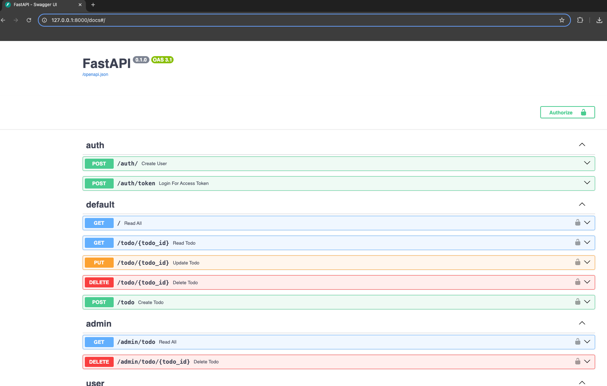

# FastAPI Introduction

FastAPI is a modern, fast (high-performance), web framework for building APIs with Python 3.6+ based on standard Python
type hints. It is designed to be easy to use, allowing developers to build and deploy APIs quickly and efficiently.

## Key Features

- **Fast**: Very high performance, on par with Node.js and Go (thanks to Starlette and Pydantic).
- **Easy**: Designed to be easy to use and learn.
- **Built-in data validation**: Using Python type hints for input data validation and serialization.
- **Asynchronous support**: Native support for asynchronous programming with Python's async/await syntax.
- **Automatic interactive API documentation**: With Swagger UI and ReDoc.



## Installing a Virtual Environment Called `fastapi`

To start using FastAPI, it's a good practice to create a virtual environment. This ensures that your project
dependencies are isolated from your system-wide Python installation.

### Step 1: Create the Virtual Environment

Run the following command to create a virtual environment named `fastapi`.
You can use any name for your virtual environment.

```bash
python -m venv fastapi
```

## Activate the Virtual Environment

After creating the virtual environment, you need
to activate it. Use the following command
depending on your operating system:

For macOS/Linux:

```bash
source fastapi/bin/activate
```

For Windows:

```bash
source fastapi/bin/activate
```

> Once activated, your command prompt should change to indicate that you are now working within the fastapi virtual
> environment.

## Deactivate the Virtual Environment

You can deactivate the virtual environment by typing the command below.

```bash
deactivate
```

## Installing FastApi

Once your virtual environment is activated, you can
install FastAPI.

```bash
pip install fastapi
```

## Installing Uvicorn

```bash
pip install 'uvicorn[standard]'
```

## Running a FastAPI Application

After installing the necessary dependencies, you can create a simple FastAPI application.
Save the following code in a file named hello_world.py:

```python
from fastapi import FastAPI

app = FastAPI()


@app.get("/")
async def read_root():
    return {"message": "Hello World !! Welcome to the FAST API"}

```

## Running the FastAPI Application

```bash
uvicorn hello_world:app --reload
```

## Swagger UI Documentation

FastAPI provides an interactive API documentation via Swagger UI.
It allows you to test the API endpoints directly from the browser.

- Open your browser and navigate to:

```bash
http://127.0.0.1:8000/docs
```

You will see a Swagger UI interface showing the available endpoints and methods. You can interact with the API by
sending requests directly from this interface.

## ReDoc Documentation

In addition to Swagger UI, FastAPI automatically generates documentation with ReDoc, which provides a more minimal and
clean layout.

- To access the ReDoc interface, navigate to:

```bash
http://127.0.0.1:8000/redoc
```

ReDoc is another API documentation tool that displays all the available endpoints in a more structured manner.


